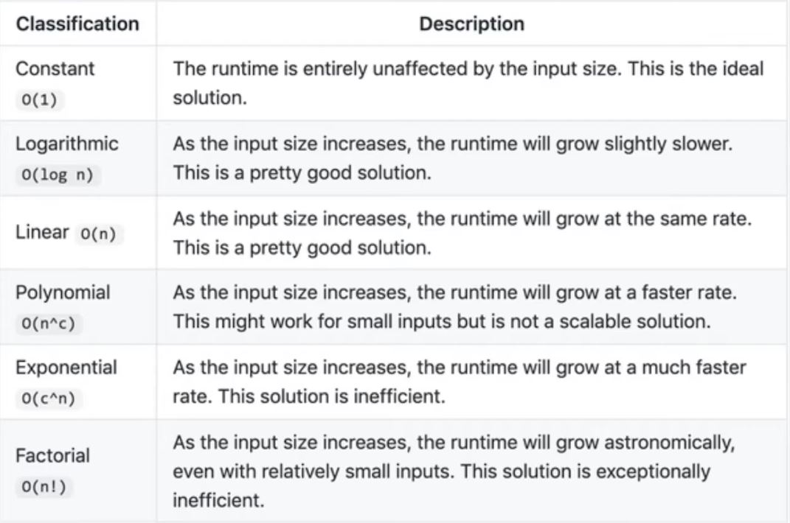

# TIME COMPLEXITY

- __Constant__ O(1)	The runtime is entirely unaffected by the input size. This is the ideal solution.
- __Logarithmic__ O(log n)	As the input size increases, the runtime will grow slightly slower. This is a pretty good solution.
- __Linear__ O(n)	As the input size increases, the runtime will grow at the same rate. This is a pretty good solution.
- __Polynomial__ O(n^c)	As the input size increases, the runtime will grow at a faster rate. This might work for small inputs but is not a scalable solution.
- __Exponential__ O(c^n)	As the input size increases, the runtime will grow at a much faster rate. This solution is inefficient.
- __Factorial__ O(n!)	As the input size increases, the runtime will grow astronomically, even with relatively small inputs. This solution is exceptionally inefficient.

╔══════════════════╦═════════════════╗
║       Name       ║ Time Complexity ║
╠══════════════════╬═════════════════╣
║ Constant Time    ║       O(1)      ║
╠══════════════════╬═════════════════╣
║ Logarithmic Time ║     O(log n)    ║
╠══════════════════╬═════════════════╣
║ Linear Time      ║       O(n)      ║
╠══════════════════╬═════════════════╣
║ Quasilinear Time ║    O(n log n)   ║
╠══════════════════╬═════════════════╣
║ Quadratic Time   ║      O(n^2)     ║
╠══════════════════╬═════════════════╣
║ Exponential Time ║      O(2^n)     ║
╠══════════════════╬═════════════════╣
║ Factorial Time   ║       O(n!)     ║
╚══════════════════╩═════════════════╝